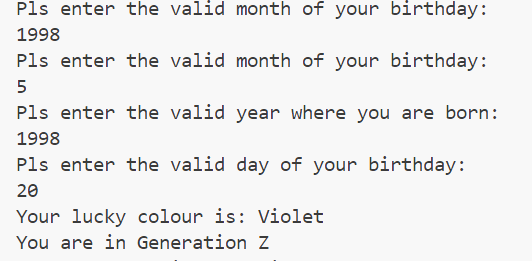
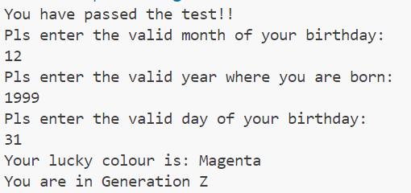
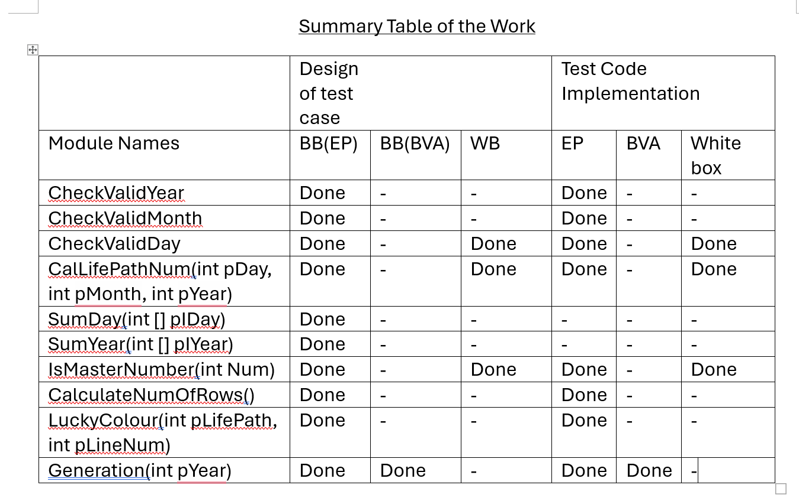

## Cover Sheet
Assignment name: ISE Final Assignment
Name: Ching Mao Jin
Curtin Student ID: 22013213
Partical Class: 10am-12pm
Signature: ChingMaoJin

## Introduction
I first created production code that asks user to enter his/her birthday and calculate the life path number according to the birthday given then determine the lucky colour based on the number. After determining the lucky colour, I will tell the user about his generation based on the year he/she was born. I have designed and implement test cases for each method in Java.

## Module Discriptions
Submodule: CheckValidDay  
Import: pDay (int), pMonth(int), pYear(int)  
Export: isValid(boolean)  
This method is to check the validity of the day entered by the user. The program will first ask the user to enter their month and year of birth. The method will then check the numbers of days available in the month entered and if the month entered by the user is 2. The method will then check whether it is a leap year. After validation, the method will then return a boolean variable. If the boolean variable is false, the user has to keep entering until it becomes true.

Submodule: CheckValidMonth  
Import: pMonth(int)  
Export: isValid(boolean)  
This method checks the validity of the month of the birth entered by the user. If the month entered by the user is between 1 to 12 inclusive, the method will return true as the boolean variable. Otherwise, it will return false and user has to enter again until it is valid.

Submodule: CheckValidYear  
Import: pYear(int)  
Export: isValid(boolean)  
This method checks the validity of the year of the birth entered by the user which ranges from 1901-2024. Any year entered that is not within this range, the method will return false as the boolean variable. 

Submodule: CalLifePathNum  
Import: pDay(int), pMonth(int), pYear(int)  
Export: LifePath(int)  
This method calculates the life path by adding up each digit in day, month and year. It will then check whether the day, month or year becomes a master number after addition. If it becomes a master number after addition, the number will not undergo any addition of the digits. If not, it will keep adding until a single digit is achieved. 

Submodule: SumDay  
Import: pIDay(int [])  
Export: AddDay(int)  
This method adds up all the digits in the arrays being passed to the method. After addition, it will then check whether the number is a 2-digit number. If it is a 2-digit number and not a master number, each digit will undergo addition again until a single digit is achieved. If it is a master number, it will remain as it is. Eventually, the number will be returned to the method "CalLifePathNum" as the variable "AddDay"

Submodule: SumYear  
Import: pIYear(int [])  
Export: AddYear(int)  
This method adds up all the digits in the arrays. After addition, it will then check whether the number is a 2-digit number. If it is 2-digit and not a master nun=mber, each digit will undergo addition again until a single digit is achieved. If it is a master number, it will not undergo after addition. Eventually, the number will be returned to the method "CalLifePathNum" as the variable "AddYear"

Submodule: IsMasterNumber  
Import: Num(int)  
Export: Master(boolean)  
This method checks whether the number passed is a master number. If it is a master number, the program will return true. If it is not a master number, the program will return false.

Submodule: CalculateNumOfRows  
Import: pFileName(String)  
Export: LineNum (int)  
This method calculates the number of rows in the LuckyColour.csv file and return the number of rows.

Submodule: LuckyColour  
Import: pLifePath(int), pLineNum(int)  
Export: LuckyColour (String)  
This method read the csv file and determine the user's lucky colour based on the lifepath given. 

Submodule: Generation  
Import: pYear(int)  
Export: gen(String)  
This method determines the generation of the user based on the year when user was born.

Submodule: Ask_User  
Import: none  
Export: none  
This method is to interact with the user and get user to input the day, month and year of birth. The user will have to re-enter until the valid day, month and year is achieved. Futhermore, the method will also display the generation of the user and the user's lucky colour.

### Explaination on  good modularity principles:
I created the methods "CheckValidDay", "CheckValidMonth" and "CheckValidYear" to seperate the jobs of checking all the inputs entered by the user which is an example of high cohesion. Futher description is available in the checklist questions.

| Checklist questions | Yes/No | Description |
| --- | --- | --- |
| Is global variable not used in the code | Yes | My program did not use any global variables which is an example of low coupling. Using global variables is messy as you may have other code that overwrites the value in the variable without knowing it. Hence, using global variables results in high-coupling. |
| Do you pass not more than 6 parameters | Yes | None of my methods passes more than 6 parameters. Passing more than 6 parameters results in high-coupling because it makes programmers hard to ensure that the order of the parameters is correct. |
| Does each of the method have at most one specific task | Yes | My program ensures that each method carries out only one specific task. For example: CheckValidDay, CheckValidYear and CheckValidMonth ensure the user enter the valid day, year, month respectively. |
| Is control flag not used in the code | No  | I did not use a control flag. |
| Are there not any duplicate code that do the same thing | No  | Some repeating codes in my program deals with different user’s inputs. The methods “SumDay” and SumYear both have similar codes but they deal with different inputs. I spilted them to follow the principle of high cohesion. |

To run the program, we will need to compile the program first by using the command line "javac Production.java" and "javac TestCode.java". After compilation, we need to execute the code by using the command line "java TestCode". The image below shows a sample output of my program. 

## Blackbox testing

Equivalence Partitioning  

Submodule: CheckValidDay  

Import: pDay(integer), pMonth(integer), pYear(integer)  

Export: IsValid(Boolean)  

| Category | Test Data | Expected Output |
| --- | --- | --- |
| Month with 30 days  D>0 AND D<=30 | D=1, M=4, 2004 | IsValid=true |
| Month with 30 days  D>30 | D=31, M=4, 2004 | IsValid=false |
| Month with 31 days  D>0 AND D<=31 | D=1, M=1, 2004 | IsValid=true |
| Month with 31 days  D>31 | D=32, M=1, 2004 | IsValid=false |
| M=2, leap year  D>0 AND D<=29 | D=1, M=2, 2004 | IsValid=true |
| M=2, leap year  D>29 | D=30, M=2, 2004 | IsValid=false |
| M=2, not leap year  D>0 AND D<=28 | D=1, M=2, 2003 | IsValid=true |
| M=2, not leap year  D>28 | D=30, M=2, 2003 | IsValid=false |
| D<=0 | D=0, M=1, 2004 | IsValid=false |

Submodule: CheckValidMonth

Import: pMonth(int)

Export: IsValid(Boolean)

| Category | Test Data | Expected Output |
| --- | --- | --- |
| M>0 AND M<=12 | M=1 | IsValid=true |
| M<=0 | M=0 | IsValid=false |
| M>12 | M=13 | IsValid=false |

Submodule: CheckValidYear

Import: pYear(int)

Export: IsValid(Boolean)

| Category | Test Data | Expected Output |
| --- | --- | --- |
| Y>=1901 AND Y<=2024 | Y=1902 | IsValid=true |
| Y<1901 | Y=1900 | IsValid=false |
| Y>2024 | Y=2025 | IsValid=false |

Submodule: CalLifePathNum

Import: pDay(int), pMonth(int), pYear(int)

Export: LifePath(int)

The method CalLifePathNum will calculate the life path by adding up each digit. After adding, the method will check if it is a 2-digit number and not a master number. If yes, the method will continue adding up each digit. If it’s a master number, the life path number will remain as master number. Master numbers are 11, 22, 33.

| Category | Test Data | Expected Output |
| --- | --- | --- |
| Is Single digit after addition | pDay=1  pMonth=1  pYear=2004 | LifePath=8 |
| Is 2-digit number,  Is a master number after addition | pDay=3  pMonth=2  pYear=2004 | LifePath=11 |
| Is 2-digit number,  Not a master number after addition | pMonth=3  pDay=1  pYear=2004 | LifePath=1 |

Submodule: IsMasterNumber

Import: Num (int)

Export: Master (Boolean)

The method “IsMasterNumber” checks whether the inputs is a Master Number. If it is a master number, it will return true. If it is not a master number, it will return false.

| Category | Test Data | Expected Output |
| --- | --- | --- |
| Num is a master number | N=11 | Master=true |
| Num is not a master number | N=3 | Master=false |

Submodule: CalculateNumOfRows

Import: none

Export: LineNum (int)

The method will calculate the number of rows available in the file and return 0 when the file is not available.

| Category | Test Data | Expected Output |
| --- | --- | --- |
| File is available. | N=12 | N=12 |
| File is not available | N=0 | N=0 |

Submodule: LuckyColour

Import: pLifePath (int), pLineNum(int)

Export: LuckyColour(String)

The method will match the life path received with the content available in the file and print out the lucky colour of the user

| Category | Test data | Expected output |
| --- | --- | --- |
| pLineNum not equal to zero. | pLifePath=1 | LuckyColour= “Red” |
| pLineNum equals to zero. | pLifePath=0 | LuckyColour= “none” |

Submodule: Generation

Import: pYear(int)

Export: Gen(String)

| Category | Test Data | Expected Output |
| --- | --- | --- |
| pYear is between 1901-1945 | pYear=1902 | Gen= “Silent Generation” |
| pYear is between 1946-1964 | pYear=1947 | Gen= “Baby Boomers” |
| pYear is between 1965-1979 | pYear= 1970 | Gen= “Generation X” |
| pYear is between 1980-1994 | pYear=1990 | Gen= “Millennials” |
| pYear is between 1995-2009 | pYear=2000 | Gen= “Generation Z” |
| pYear is between 2010-2024 | pYear=2014 | Gen= “Generation Alpha” |

Boundary Value Analysis

Submodule: Generation

Import: pYear(int)

Export: Gen(String)

| Boundary | Test data | Expected Output |
| --- | --- | --- |
| 1901<=Y<=1945 / 1946<=Y<=1964 | Y=1945  Y=1946 | Gen= “Silent Generation”  Gen= “Baby Boomers” |
| 1946<=Y<=1964 / 1965<=Y<=1979 | Y=1964  Y=1965 | Gen= “Baby Boomers”  Gen= “Generation X” |
| 1965<=Y<=1979 /  1980<=Y<=1994 | Y=1979  Y=1980 | Gen= “Generation X”  Gen= “Millennials” |
| 1980<=Y<=1994 /  1995<=Y<=2009 | Y=1994  Y=1995 | Gen= “Millennials”  Gen= “Generation Z” |
| 1995<=Y<=2009 /  2010<=Y<=2024 | Y=2009  Y=2010 | Gen= “Generation Z”  Gen= “Generation Alpha” |

White Box Testing

Submodule: CheckValidDay

Import: pYear(int), pMonth(int), pDay(int)

Export: isValid (Boolean)

I decided to do white box testing for the method “CheckValidDay” because it is highly coupled with the year and month entered by the user. The method has multiple if constructs and loops, so it is good to know the possible paths.

| Path | Test data | Expected Output |
| --- | --- | --- |
| Enter the 1st for-loop and inner if statement | M=1, D=1, Y=2004 | isValid=true |
| Enter the 1st for-loop and does not enter the inner if statement | M=-1, D=-1, Y=2004 | isValid=false |
| Enter 2nd for-loop and inner if statement | M= 4, D=1, Y=2004 | isValid=true |
| Enter 2nd for-loop and does not enter the inner if statement | M=4, D=-1, Y=2004 | isValid=false |
| Enter the 1st outer if-construct | Y=2004, M=2, D=1 | isValid=true |
| Enter the 2nd outer if-construct | Y=2003, M=2, D=1 | isValid=true |
| Does not enter any loop or if-construct | Y=0, M=0, D=0 | isValid=false |

Submodule: IsMasterNumber

Import: Num(int)

Export: Master (boolean)

| Path | Test Data | Expected Output |
| --- | --- | --- |
| Enter the if path | Num= 11 | Master= true |
| Enter the else path | Num=2 | Master= false |

Submodule: CalLifePathNum

Import: pDay(int), pMonth(int), pYear(int)

Export: LifePath (int)

| Path | Test Data | Expected Output |
| --- | --- | --- |
| pDay and pMonth are all master number  LifePath is master number | D=11  M=11  Y=1901 | LifePath= 33 |
| pDay and pMonth are all master number  LifePath is not a master number | D=11  M=11  Y=1999 | LifePath=5 |
| pDay is a master number,  pMonth is not a master number  LifePath is a master number | D=11  M=9  Y=2000 | LifePath=22 |
| pDay is a master number,  pMonth is not a master number  LifePath is not a master number | D=11  M=9  Y=2001 | LifePath=5 |
| pDay is not a master number,  pMonth is a master number  LifePath is a master number | D=18  M=11  Y=2000 | LifePath=22 |
| pDay is not a master number,  pMonth is a master number  LifePath is not a master number | D=18  M=11  Y=2001 | LifePath=5 |

#### Declaration: I did not implement the test design for the method "SumYear" and "SumDay" as these two method are called in the method "CalLifePathNum". If the "CalLifePathNum" can pass the test, there should not be any issue with the SumYear and SumDay methods.

## Test Implementation and task execution

I wrote my test code in TestCode.java file. I first compile the java file to see if there's any syntax error in my code by using the command line "javac TestCode.java". After checking, I enter the command line "java TestCode" to execute my code. I modified my production code after I realized that it prodeced the wrong lucky colour when the year of user's birth undergoes more than 2 times of addition. I tried inputing year= 1999, month=9 and day=30, it generated lucky colour as white which is incorrect. Then I modified my production code to accomodate the requirements. 

The image below is my summary of work.

## The following is the log of my version control system
commit 0416e6b480c65ddf7bb96b178e74d2043e727a94 (HEAD -> master)
Author: Ching Mao Jin <22013213@student.curtin.edu.au>
Date:   Thu May 23 13:40:43 2024 +0800

    Modifying the code

commit f180c5dd9317df5b2035bc78712316812ea5a08a (WhiteBoxTesting)
Author: Ching Mao Jin <22013213@student.curtin.edu.au>
Date:   Wed May 22 11:32:07 2024 +0800

    Debugging and implementing test cases

commit 4e03c242cfc29263c7b88ff3d2da294bbcd42cb5
Author: Ching Mao Jin <22013213@student.curtin.edu.au>
Date:   Tue May 21 12:17:39 2024 +0800

    Modifying TestCheckValidDay

commit 8b6973a3f2bb9485573de1d0d199ade998040b17
Author: Ching Mao Jin <22013213@student.curtin.edu.au>
Date:   Tue May 21 12:16:52 2024 +0800

    Modifying CheckvalidDay

commit e7da2c613602d4e8648f6a792b6af6be90f69bb5
Author: Ching Mao Jin <22013213@student.curtin.edu.au>
Date:   Fri May 17 21:26:46 2024 +0800

    Changing return type for CheckValids

commit cbaded26875e1526c4de39522229cf1219111b47
Author: Ching Mao Jin <22013213@student.curtin.edu.au>
Date:   Fri May 17 13:05:58 2024 +0800

    Removing the main function

commit 5663bd3d029ae9a3e2a7890e842fe2237aee3633
Author: Ching Mao Jin <22013213@student.curtin.edu.au>
Date:   Thu May 16 20:20:26 2024 +0800

    Adding method

commit 4e853c81ba462bf7731540fcfad7c868f1c25a81
Author: Ching Mao Jin <22013213@student.curtin.edu.au>
Date:   Thu May 16 20:07:23 2024 +0800

    Debugging code

commit 57b679fa17dd617f9671f3b0f6f9d51866ccc0d7
Author: Ching Mao Jin <22013213@student.curtin.edu.au>
Date:   Thu May 16 18:19:35 2024 +0800

    Initial Commit
~  

#### I first created a branch called "Testing" to modify TestCheckValidDay method in my TestCode. After merging the branch, I deleted the branch "Testing". I created another new branch "WhiteBoxTesting" for debugging and implement test cases for white box testing. After that, I merged the branch. 

## Discussion:  
I have created a program that asks user to enter their birthday. Based on the birthday entered, my program will calculate the life path number and determine the user's lucky colour after calculating the life path number. After determining the lucky colour, the program will show the generation of the colour based on the year of the birth provided by the user. In the meantime testing the code, I realized that my production code fails to check the validity of the day based on the month and the year given. I modified the code in the method CheckValidDay. Next, I realized that the method 'SumDay' and 'SumYear' did not keep adding the digits until single digit when the 2-digit number is not a master number. I modified the codes in the methods in a way that can do the work as desired. 